# Poke Idle - Breeding Center Calculator

An advanced calculation tool designed as a UI overlay for the Poke idle World Breeding Center.

---

## ⚡ Features

-  **Quality Projections:** Estimates total breeds, hunt kills, and hours needed for every quality tier (*Common* to *Divine*).
-  **Step-by-Step Material Chain:** Interactive breakdown displaying exact secondary material quality ranges ($\pm0.15$ Q) for each breed step.
-  **Evolution Stones & Pheromones:** Automatic detection for required stones and "Double Stones" multiplier with itemized Gold cost calculation.
-  **IV Loss Warning:** Instant visual alert if your higher-quality parent has lower IVs.
-  **Data Export:** Export complete project data directly to your clipboard in **JSON** or **CSV** format.

---
## 📸 Preview & Screenshots

#### Tool Overview

---

#### Material Chain Table

---

#### Settings and Automatic Stone Detection

---

#### JSON & CSV Export Format

#### IV Loss Warning

---

## 📖 How to Use

1. **Select 2 Pokémon for Breeding:**
   - The tool automatically detects both Pokémon and their stats, as well as the active breeding mode (**Pheromones** or **Free**).
   - It also detects any required **Evolution Stones** and whether the **Double Stones** option is active.

2. **Configure Settings:**
   - **Pheromone Price:** Set the market or purchasing unit cost for pheromones (defaults to 1,000,000 Gold).
   - **Stone Prices:** Input the current market price for any required evolution stones if you want to include them in the total gold calculations.
   - **Kills/h:** Enter your hourly defeat rate to project total farming time.

3. **Select Growth System:**
   - **Minimum:** Uses the minimum growth delta per breed step (**+0.15** for Pheromones, **+0.005** for Free mode).
   - **Average:** Calculates expected growth based on weighted outcome probabilities (**~+0.1875** for Pheromones, ranging from +0.15 [50%] to +0.30 [5%]; **~+0.0096** for Free mode, ranging from +0.005 [50%] to +0.04 [5%]).

4. **View Projections & Material Chains:**
   - The table displays estimated breeds needed to reach each quality tier (*Common* through *Divine*), along with total Gold costs, required defeats (kills), and projected hours based on your Kills/h setting.
   - **Click on any quality tier row** to expand a step-by-step list showing the exact required Quality range for the secondary parent. *(Note: The primary parent is always the offspring resulting from the previous breed in the chain).*

5. **Export Data:**
   - Click **Export JSON** or **Export CSV** to copy the complete calculation payload directly to your clipboard for personal tracking or spreadsheet analysis.

---
## 🧮 How the Math Works (The Breeding Pyramid)

When calculating the cost of reaching high Quality tiers (like **Divine Q 4.0**), the calculator simulates the exact number of breeds required to create **Secondary Materials** from scratch. 

Since the maximum Quality you can catch in the wild is **1.80 (Legendary)**, any secondary parent required above 1.80 must be fabricated by breeding wild Pokémon together in a recursive cascade (a pyramid). Because breeding consumes **both** parents, the number of Pokémon required grows exponentially at every step.

### The Optimal `-0.15` Inheritance Rule
To minimize the explosive exponential cost, the calculator assumes you are always using the **optimal secondary material** (which is up to **-0.15 Q** lower than the main parent). 

As long as the main parent has a higher Quality (e.g., Main is 2.50, Sec is 2.35), the game will inherit the main parent's IVs. There is no benefit to making them identical (e.g., -0.01 difference), and doing so would cause the required breeds to skyrocket into trillions. 

By using the -0.15 difference, the secondary parent skips an entire "generation" of breeding on the right side of the tree, shifting the cost from a terrifying **Exponential Growth (O(2n))** down to the **Fibonacci Sequence (O(1.618n))**.

### Visualizing the Breeding Pyramid
Here is a slightly larger representation of how a single target Pokémon (Q 2.56) requires a cascading pyramid of wild Pokémon to be built from scratch. 

*(**Note on the numbers:** This example assumes the **Average Growth System with Pheromones**, which yields **~+0.1875 Q** per breed. This is why the difference between a child like Q 2.56 and its main parent Q 2.37 is roughly 0.19, rather than the absolute minimum of 0.15).*

Notice how the rightmost branches (the Secondary materials) touch the wild threshold (Q $\le$ 1.80) much faster! The entire far-right branch terminates a full generation early, visually proving the shift to Fibonacci.

```mermaid
graph TD
    %% Layer 0
    T["🎯 Target (Q 2.56)"] --> M1["👑 Main (Q 2.37)"]
    T --> S1["🧩 Sec (Q 2.22)"]
    
    %% Layer 1
    M1 --> M2a["👑 Main (Q 2.18)"]
    M1 --> S2a["🧩 Sec (Q 2.03)"]
    
    S1 --> M2b["👑 Main (Q 2.03)"]
    S1 --> S2b["🧩 Sec (Q 1.88)"]
    
    %% Layer 2
    M2a --> M3a["👑 Main (Q 1.99)"]
    M2a --> S3a["🧩 Sec (Q 1.84)"]
    
    S2a --> M3b["👑 Main (Q 1.84)"]
    S2a --> S3b["🌿 Sec (Q 1.69)"]
    
    M2b --> M3c["👑 Main (Q 1.84)"]
    M2b --> S3c["🌿 Sec (Q 1.69)"]
    
    S2b --> M3d["🌿 Main (Q 1.69)"]
    S2b --> S3d["🌿 Sec (Q 1.54)"]
    
    %% Layer 3 (Only for nodes that didn't terminate)
    M3a --> M4a["🌿 Main (Q 1.80)"]
    M3a --> S4a["🌿 Sec (Q 1.65)"]
    
    S3a --> M4b["🌿 Main (Q 1.65)"]
    S3a --> S4b["🌿 Sec (Q 1.50)"]
    
    M3b --> M4c["🌿 Main (Q 1.65)"]
    M3b --> S4c["🌿 Sec (Q 1.50)"]
    
    M3c --> M4d["🌿 Main (Q 1.65)"]
    M3c --> S4d["🌿 Sec (Q 1.50)"]

    classDef wild fill:#2d4a22,stroke:#4CAF50,stroke-width:2px;
    class S3b,S3c,M3d,S3d,M4a,S4a,M4b,S4b,M4c,S4c,M4d,S4d wild
```

*(The 🌿 nodes represent Pokémon that can be caught in the wild without needing to breed).*

### Visualizing Free Mode (The "15-Generation Skip")
In **Free Mode**, the average growth per breed is tiny ($\sim$ +0.01 Q). However, the game still allows the same massive **-0.15 Q** difference for the secondary parent. 

This means $0.15 / 0.01 = 15$. The secondary parent is effectively **15 generations older** than the main parent! If you are breeding anything below Q 1.95, the secondary parent you need is **already wild**. The tree doesn't even form a pyramid; it becomes a straight line, completely shattering the exponential curve into a linear one for the first 15 steps:

```mermaid
graph TD
    T["🎯 Target (Q 1.95)"] --> M1["👑 Main (Q 1.94)"]
    T --> S1["🌿 Sec (Q 1.79 WILD)"]
    
    M1 --> M2["👑 Main (Q 1.93)"]
    M1 --> S2["🌿 Sec (Q 1.78 WILD)"]
    
    M2 --> M3["👑 Main (Q 1.92)"]
    M2 --> S3["🌿 Sec (Q 1.77 WILD)"]
    
    M3 -. "11 more breeds..." .-> M14["👑 Main (Q 1.81)"]
    M14 --> M15["🌿 Main (Q 1.80 WILD)"]
    M14 --> S15["🌿 Sec (Q 1.66 WILD)"]
    
    classDef wild fill:#2d4a22,stroke:#4CAF50,stroke-width:2px;
    class S1,S2,S3,M15,S15 wild
```

*(As you can see, because the secondary parent skips 15 steps down, it hits the $\le$ 1.80 wild threshold instantly. You only breed the main spine!)*

**However, this changes drastically at higher Qualities.** Once your Target Quality exceeds 1.95, your secondary parents (which are 0.15 lower) will also start exceeding 1.80. This means you must start building pyramids just to create your secondary parents! While the 15-generation skip delays the explosion, the math eventually catches up, which is why the Free Mode curve still skyrockets exponentially into the trillions when aiming for Divine (Q 4.0).

### Cost Comparison Graph

*(Note: Notice how the orange Fibonacci curve for Free Mode skyrockets as Quality increases, while the green curve for Pheromones Mode stays perfectly flat and manageable).*

**Important Note for Pheromones:** 
Because Pheromones provide a massive +0.1875 Q jump per breed, the -0.15 difference is fully absorbed within a single step. Therefore, the massive cost reduction from Fibonacci skipping is most noticeable in **Free Mode**, where the tiny +0.0050 step size allows the -0.15 difference to skip up to 30 generations of the pyramid.

---
## 🌐 Browser Compatibility

This userscript is compatible with any modern desktop browser running a script manager extension:

| Browser | Recommended Manager Extension |
| :--- | :--- |
| **Google Chrome / Brave / Edge** | [Tampermonkey](https://www.tampermonkey.net/) or [Violentmonkey](https://violentmonkey.github.io/) |
| **Mozilla Firefox** | [Tampermonkey](https://www.tampermonkey.net/) or [Greasemonkey](https://addons.mozilla.org/firefox/addon/greasemonkey/) |
| **Opera / Opera GX** | [Tampermonkey](https://www.tampermonkey.net/) |
| **Safari** | [Tampermonkey](https://www.tampermonkey.net/) |

---

## 📦 Installation

### Option 1: Automatic Installation (Recommended)

1. Make sure you have a script manager extension (such as **[Tampermonkey](https://www.tampermonkey.net/)**) installed in your browser.
2. Click the link below to install the script automatically:

👉 **[INSTALL USERSCRIPT DIRECTLY](https://raw.githubusercontent.com/hariseld/pokeidle_bc/main/pokeidle_bc.user.js)** 👈

3. Tampermonkey will prompt an installation tab. Click **"Install"**.
4. Open or refresh the game tab!

---

### Option 2: Manual Installation

If the automatic link does not trigger your script manager, follow these steps:

1. Open your browser's extension panel for **Tampermonkey** and click **"Create a new script..."**.
2. Open the script file from this repository: [`pokeidle_bc.user.js`](https://github.com/hariseld/pokeidle_bc/blob/main/pokeidle_bc.user.js).
3. Copy the entire JavaScript code.
4. Paste the code inside the Tampermonkey script editor, replacing any default template text.
5. Save the script (**Ctrl + S** or `File -> Save`).
6. Refresh the game tab.

---
